# Вестников Роман - 4 Лабораторная работа

## Предисловие

За выполнение всех преобразований Фурье отвечает класс _FourierTransform_. При инициализации необходимо выбрать одно из трёх преобразований: _DFT_OpenCV_ - используются встроенные методы _OpenCV_, _DFT_ - ручное DFT "лобовое", _FFT_ - ручное FFT "бабочка". 
Дальше необходимо инициализировать либо начальное изображение и запустить весь цикл Фурье (прямой и обратноый), либо только Фурье образ и запстить обратное. Другие комбинации в данной лабе не используются, но потенциально возможны.

___

## 1 задание - DFT "лобовой подход"

Метод _FourierTransform::dft_ осуществляет сперва построчное преобразование исходного изображения с предварительно посчитанной матрицей _W_ через метод _FourierTransform::get_W._ Затем полученное изображение по столбикам снова проходит через Фурье с новой матрицей _W_.

Результат:

  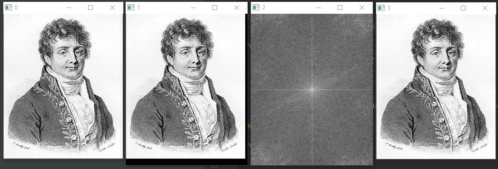
      

Слева направо: исходное изображение, изображение с паддингом, Фурье спектр, обратно преобразованное + обрезанное изображение

Исходное и конечное изображения сохранялись в Numpy массив и были проверены на соответствие через скрипт _compare_numpy.py_. Точность 99.999%. Возможные потери связаны с FP32 типом.

___

## 2 задание - FFT "Бабочка"

Самое ~~тупое~~ бесполезное задание. Было потрачено огромное кол-во времени тупо для того, чтобы отладить весь этот бред в питоне, а затем повторить в С++ 😡 (особенно сравнивая с куда более полезными и интересными заданиями в этой и других лабах). Ну да ладно...

Принцип очень похож на 1 задание, также считывается всё сперва построчно, а затем по столбикам. Разница лишь в рекурсивном подходе, а также использовании изображений со сторонами равными степеням двойки (обеспечивается паддингом).

Результат:

  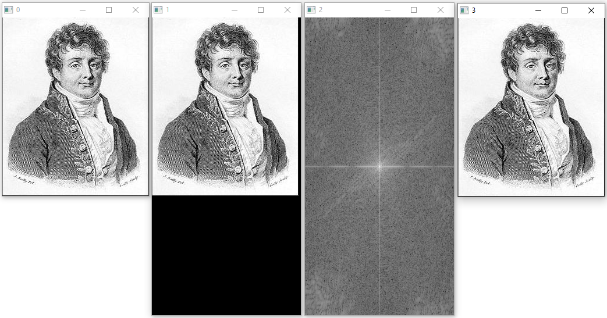
      

Слева направо: исходное изображение, изображение с паддингом, Фурье спектр, обратно преобразованное + обрезанное изображение

___

## 3 задание - Быстродействие

Быстродействие в C++ оценивалось при помощи _std::chrono::high_resolution_clock_. Ради интереса было также проверено быстродействие в _Python_.

Результат:

  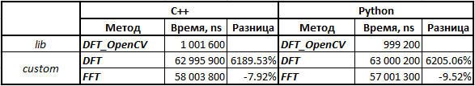
      

Как можно видеть скорость встроенной ф-ии на порядок выше моей. Время выполнения кастомной DFT при множестве экспериментов особо не изменялось, и дисперсия была не высокой. При этом кастомная FFT скакала как ненормальная, порой выдавая значения, отличаяющиеся в разы между опытами. Посему объективности в этих результатах для FFT не очень много, в отличие от DFT.

Более интерсно, что скорость выполнения в С++ и Python практически не отличается. Скорее всего это потому, что в целом там не используются собственные питоновские методы, а лишь различные векторные и матричные вычисления в Numpy, написанном на C. Поэтому и нет разницы в скорости.  

___

## 7 задание - Свёртка

Вручную создавалась желаемая матрица свёртки (3х3). Затем паддингом она расширялась до размеров изображения (вручную задавая атрибуты класса). Затем проводилось DFT обоих изображений (исходного и ядра). Их Фурье образы перемножались через _mulSpectrums_ и результат проходил через обратное DFT.

Результаты:

* XSobel:

  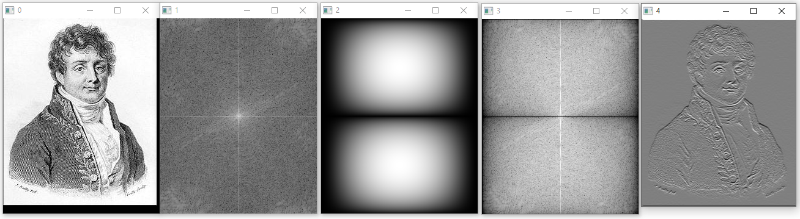
      

Слева направо: исходное изображение с паддингом, Фурье спектр исходного изображения, Фурье спектр ядра свёртки, Фурье спектр их перемножения, обратное преобразование результата.

Можно видеть выделение горизонтальных границ, что говорит о правильности работы фильтра.

* YSobel:

  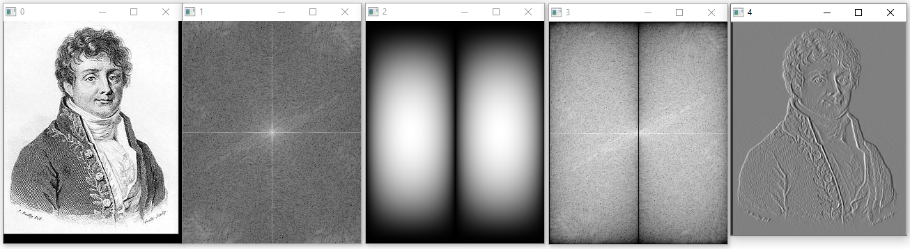
      

Аналогично выделяются вертикальные границы.

* Laplas:

  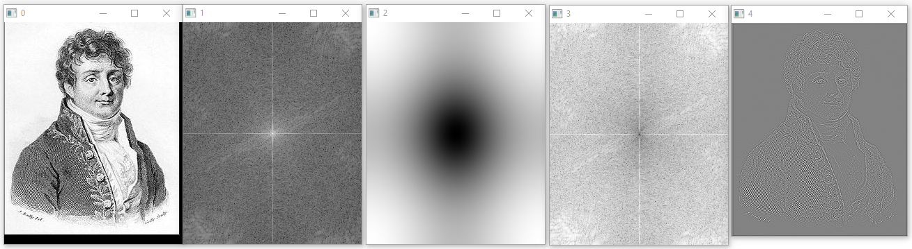
      

Т.к. Лаплас это по сути фильтр высоких частот (далее HPF), то он выделяет края на изображении, что и сделано.

* Box:

  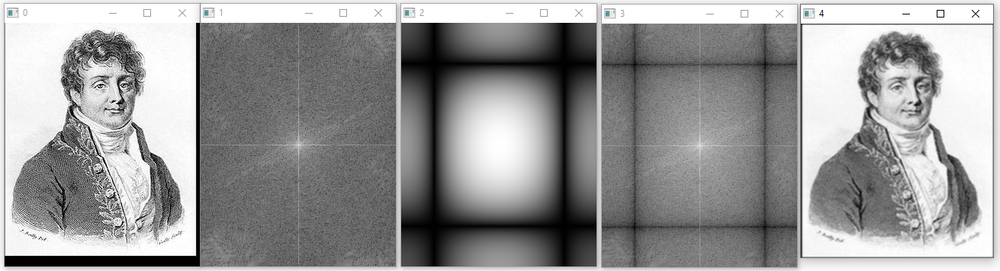
      

Box фильтр равномерно усредняет изображение, делая его размытым, что мы и видим в результате.

___

## 8 задание - Low/High-pass filters

Реализуем идеальные фильтр высоких частот (HPF) и фильтр низких частот (LPF), используя маски из OpenCV. Далее наложим полученные маски на Фурье образ сходного изображения и сделаем обратное преобразование.

* Low-pass filter:

  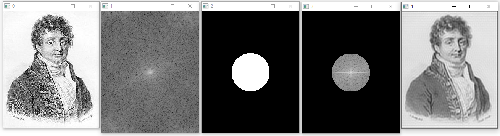
      

Слева направо: исходное изображение, Фурье спектр исходного изображения, маска фильтра, наложение маски на Фурье спектр, обратное преобразование результата.

LPF должен отбрасывать высокие частоты, делая изображение более размытым, как на результате.

Также можно видеть "звон" на полученном изображении, явялющимся побочным эффектом идеального LPF.

* High-pass filter:

  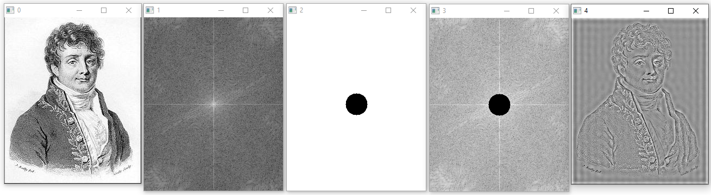
      

HPF наолборот отбрасывает высокие частоты, оставляя лишь гранцы.

Звон стал виден даже ещё сильнее, чем в случае LPF.

## 9 задание - Корреляция

Будем осуществлять поиск трёх символов на картинке. Сперва инверсируем шаблон и картинку. Затем представим их в виде Фурье образов одинакового размера и перемножим их. Далее проведём алгоритм, описанный в задании для поиска символов.

Исходное ихображение:

  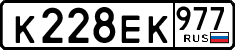
      

Результат:

* Поиск "К":

  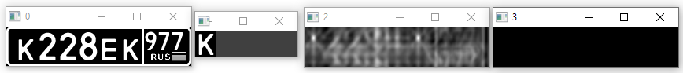
      

Слева направо: исходное инверсированное изображение, инверсированный шаблон, Фурье спектр перемножения их Фурье спектров, результат детекции.

* Поиск "2":

  
      

* Поиск "9":

  
      

Как можно видеть, во всех случаях алгоритм точно предсказал положение шаблона на исходнике. Следовательно, всё работает верно.